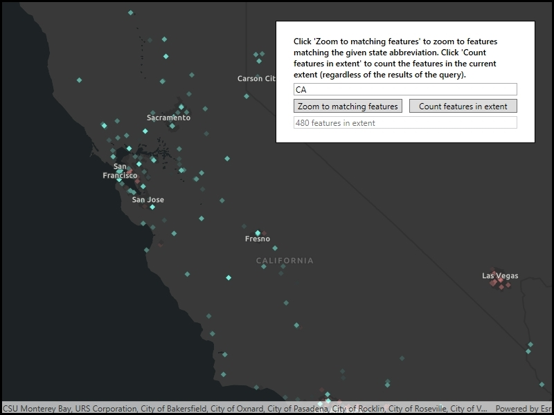

# Query feature count and extent

Zoom to features matching a query and count the features in the current visible extent.

## How to use the sample

Use the button to zoom to the extent of the state specified (by abbreviation) in the textbox or use the button to count the features in the current extent.

## How it works

Querying by state abbreviation:

1. A `QueryParameters` object is created with a `WhereClause`.
2. `FeatureTable.QueryExtentAsync` is called with the `QueryParameters` object to obtain the extent that contains all matching features.
3. The extent is converted to a `Viewpoint`, which is passed to `MapView.SetViewpointAsync`.

Counting features in the current extent:

1. The current visible extent is obtained from a call to `MapView.GetCurrentViewpoint(ViewpointType)`.
2. A `QueryParameters` object is created with the visible extent and a defined `SpatialRelationship` (in this case 'intersects').
3. The count of matching features is obtained from a call to `FeatureTable.QueryFeatureCountAsync`.

## Relevant API

* `QueryParameters`
* `QueryParameters.WhereClause`
* `QueryParameters.Geometry`
* `QueryParameters.SpatialRelationship`
* `FeatureTable.QueryExtentAsync`
* `FeatureTable.QueryFeatureCountAsync`
* `MapView.GetCurrentViewpoint(ViewpointType)`

## About the data

[See the layer on ArcGIS Online](https://www.arcgis.com/home/item.html?id=c8810b20c01b4e8ba5cd848966a66d7b)

This map shows hospital spending per-patient for common incidents. Hospitals in blue/turquoise spend less than the national average. Red/salmon indicates higher spending relative to other hospitals, while gray is average.

## Tags

Feature layer, Feature table, Query, Medicare